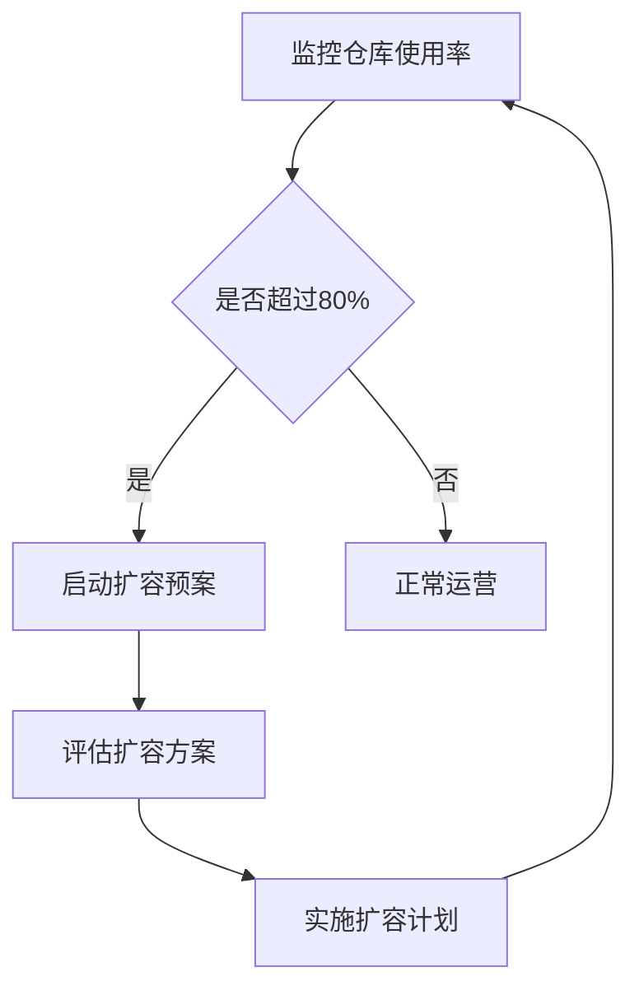
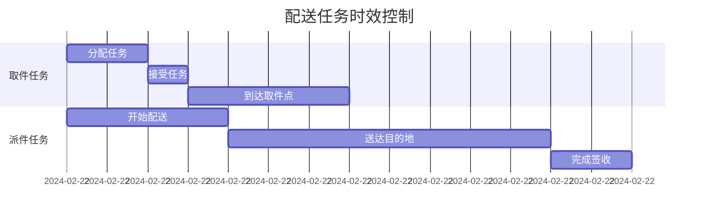
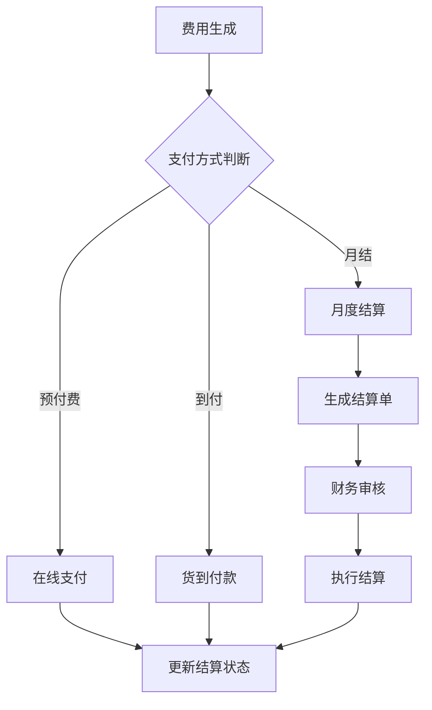
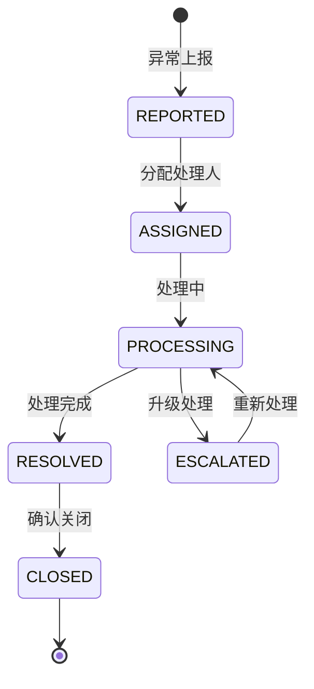

# 电商物流系统数据库设计文档

## 文档信息

| 信息项   | 内容                         |
| -------- | ---------------------------- |
| 文档名称 | 电商物流系统数据库设计说明书 |
| 版本号   | V1.0                         |
| 作者     |                              |
| 创建日期 | 2024-02-22                   |
| 更新日期 | 2024-02-22                   |
| 状态     | 正式版                       |
| 密级     | 内部文档                     |

## 1. 引言

### 1.1 编写目的
本文档旨在详细说明电商物流系统的数据库设计，包括数据库的总体设计、各个表的详细设计以及相关说明，为系统开发和后期维护提供依据。本文档面向系统开发人员、数据库管理员以及系统维护人员。

### 1.2 系统概述
本系统是面向电商平台的物流管理系统，主要包含以下功能模块：
- 订单管理：订单创建、订单跟踪、订单状态管理
- 仓储管理：仓库信息维护、库存调拨、出入库管理
- 物流配送：配送任务分配、配送状态跟踪、配送异常处理
- 费用管理：运费规则配置、费用计算、费用结算
- 评价管理：物流服务评价、问题反馈处理
- 配送员管理：配送员信息维护、工作量统计、绩效评估
- 异常处理：物流异常记录、处理跟踪、退货管理

### 1.3 参考资料
- 《GB/T 19680-2013 物流信息分类与代码》
- 《GB/T 33745-2017 电子商务物流服务指标体系》
- 《MySQL 8.0 Reference Manual》
- 《阿里巴巴Java开发手册》数据库规约章节
- 《京东物流服务标准》

## 2. 总体设计

### 2.1 设计原则

#### 2.1.1 基础设计原则
1. **三范式原则**
   - 确保每列都具有原子性
   - 确保每列都依赖于主键
   - 确保每列都直接依赖于主键

2. **业务适配原则**
   - 充分考虑业务特点和需求
   - 预留系统扩展空间
   - 支持业务灵活变更

3. **性能优化原则**
   - 合理设计索引
   - 适当冗余设计
   - 考虑分表分库策略

4. **安全性原则**
   - 数据加密存储
   - 访问权限控制
   - 操作日志记录

#### 2.1.2 具体设计标准
1. **命名规范**
   - 所有数据库对象采用小写字母命名
   - 表名使用英文名词，多个单词用下划线分隔
   - 字段名使用英文单词，多个单词用下划线分隔
   - 索引名称以 idx_ 开头
   - 唯一索引以 uniq_ 开头
   - 外键以 fk_ 开头

2. **字段设计规范**
   - 所有表必须包含 id、create_time、update_time 字段
   - 表示状态的字段使用 tinyint 类型，并说明每个数值的含义
   - 金额字段统一使用 decimal(10,2) 类型
   - 所有字段都必须有注释
   - 时间类型统一使用 datetime 类型

3. **索引设计规范**
   - 主键索引名为 PRIMARY
   - 唯一索引中的字段必须添加 NOT NULL 约束
   - 单表索引数量不超过 5 个
   - 索引字段数不超过 5 个
   - 选择区分度高的列作为索引

### 2.2 数据库环境

#### 2.2.1 开发环境
- 数据库版本：MySQL 8.0.27
- 字符集：utf8mb4
- 排序规则：utf8mb4_unicode_ci
- 连接池：HikariCP
- 最大连接数：200

#### 2.2.2 生产环境建议配置
- 数据库版本：MySQL 8.0.27 企业版
- 主从架构：1主2从
- 数据备份：每日全量 + 每4小时增量
- 监控系统：Prometheus + Grafana
- 最大连接数：500

### 2.3 安全设计

#### 2.3.1 数据加密
- 用户敏感信息（手机号、身份证号等）采用 AES 加密存储
- 密码字段使用 PBKDF2 算法加盐存储
- 重要配置信息使用配置中心加密存储

#### 2.3.2 访问控制
- 实施 RBAC 权限控制
- 数据库账号按角色分配
- 定期更新数据库密码
- 限制数据库远程访问IP

#### 2.3.3 审计日志
- 记录所有 DDL 操作
- 记录重要数据的 DML 操作
- 记录异常访问信息
- 日志保留时间：180天

## 3. 表设计详细说明

### 3.1 订单相关表

#### 3.1.1 订单主表(orders)

**表说明**：存储订单的基本信息，是整个物流系统的核心表之一。

**表定义**：
```sql
CREATE TABLE orders (
    order_id VARCHAR(32) PRIMARY KEY COMMENT '订单ID',
    user_id VARCHAR(32) NOT NULL COMMENT '用户ID',
    order_status VARCHAR(20) NOT NULL COMMENT '订单状态',
    order_type VARCHAR(20) NOT NULL COMMENT '订单类型：普通/预售/跨境',
    create_time DATETIME NOT NULL COMMENT '创建时间',
    payment_time DATETIME COMMENT '支付时间',
    total_amount DECIMAL(10,2) NOT NULL COMMENT '订单总金额',
    receiver_name VARCHAR(50) NOT NULL COMMENT '收货人姓名',
    receiver_phone VARCHAR(20) NOT NULL COMMENT '收货人电话',
    receiver_province VARCHAR(50) NOT NULL COMMENT '省',
    receiver_city VARCHAR(50) NOT NULL COMMENT '市',
    receiver_district VARCHAR(50) NOT NULL COMMENT '区',
    receiver_address TEXT NOT NULL COMMENT '详细地址',
    receiver_zip VARCHAR(10) COMMENT '邮编',
    INDEX idx_user_id (user_id),
    INDEX idx_create_time (create_time)
) COMMENT '订单主表';
```

**字段说明**：

| 字段名 | 类型 | 必填 | 默认值 | 说明 | 取值范围 |
|--------|------|------|--------|------|----------|
| order_id | VARCHAR(32) | 是 | - | 订单ID | 系统生成的唯一标识 |
| user_id | VARCHAR(32) | 是 | - | 用户ID | 关联用户表的ID |
| order_status | VARCHAR(20) | 是 | - | 订单状态 | CREATED,PAID,SHIPPING,DELIVERED,COMPLETED,CANCELLED |
| order_type | VARCHAR(20) | 是 | - | 订单类型 | NORMAL,PRESELL,CROSS_BORDER |
| create_time | DATETIME | 是 | - | 创建时间 | - |
| payment_time | DATETIME | 否 | NULL | 支付时间 | - |
| total_amount | DECIMAL(10,2) | 是 | - | 订单总金额 | >0 |
| receiver_name | VARCHAR(50) | 是 | - | 收货人姓名 | - |
| receiver_phone | VARCHAR(20) | 是 | - | 收货人电话 | 手机号/固定电话 |
| receiver_province | VARCHAR(50) | 是 | - | 省 | 中国行政区划省级名称 |
| receiver_city | VARCHAR(50) | 是 | - | 市 | 中国行政区划市级名称 |
| receiver_district | VARCHAR(50) | 是 | - | 区 | 中国行政区划区级名称 |
| receiver_address | TEXT | 是 | - | 详细地址 | - |
| receiver_zip | VARCHAR(10) | 否 | NULL | 邮编 | 6位数字 |

**索引说明**：
1. 主键索引：order_id
   - 使用场景：订单详情查询、订单状态更新
   - 性能要求：响应时间 < 10ms
   
2. 普通索引：idx_user_id (user_id)
   - 使用场景：查询用户订单列表
   - 性能要求：响应时间 < 100ms
   
3. 普通索引：idx_create_time (create_time)
   - 使用场景：订单统计、订单列表查询
   - 性能要求：响应时间 < 100ms

**状态定义**：
1. order_status:
   - CREATED: 已创建（未支付）
   - PAID: 已支付（待发货）
   - SHIPPING: 配送中
   - DELIVERED: 已送达
   - COMPLETED: 已完成
   - CANCELLED: 已取消

2. order_type:
   - NORMAL: 普通订单
   - PRESELL: 预售订单
   - CROSS_BORDER: 跨境订单

**业务规则**：
1. order_id 生成规则：
   - 格式：yyyyMMddHHmmss + 6位随机数
   - 示例：20240222143022123456

2. 状态流转规则：
   - CREATED -> PAID: 用户完成支付
   - PAID -> SHIPPING: 商家发货
   - SHIPPING -> DELIVERED: 物流配送完成
   - DELIVERED -> COMPLETED: 用户确认收货或超时自动确认
   - 任意状态 -> CANCELLED: 订单取消（满足取消条件）

3. 金额计算规则：
   - total_amount = 商品金额 + 运费 - 优惠金额

4. 数据维护建议：
   - 每日凌晨对已完成订单进行归档
   - 定期清理已取消的订单数据
   - 重要字段变更记录操作日志

5. 注意事项：
   - 收货人信息需进行加密存储
   - 订单状态变更需要有相应的操作权限
   - 关键操作需要记录操作日志

#### 3.1.2 物流订单表(logistics_orders)

**表说明**：存储订单物流信息，是物流跟踪的核心表。一个订单只能对应一个物流订单。

**表定义**：
```sql
CREATE TABLE logistics_orders (
    logistics_id VARCHAR(32) PRIMARY KEY COMMENT '物流订单ID',
    order_id VARCHAR(32) NOT NULL COMMENT '订单ID',
    warehouse_id VARCHAR(32) NOT NULL COMMENT '发货仓库ID',
    tracking_number VARCHAR(32) NOT NULL COMMENT '物流单号',
    logistics_company_id VARCHAR(32) NOT NULL COMMENT '物流公司ID',
    logistics_type VARCHAR(20) NOT NULL COMMENT '物流类型：普通/快递/同城',
    logistics_status VARCHAR(20) NOT NULL COMMENT '物流状态',
    shipping_time DATETIME COMMENT '发货时间',
    estimated_delivery_time DATETIME COMMENT '预计送达时间',
    actual_delivery_time DATETIME COMMENT '实际送达时间',
    create_time DATETIME NOT NULL COMMENT '创建时间',
    update_time DATETIME NOT NULL COMMENT '更新时间',
    FOREIGN KEY (order_id) REFERENCES orders(order_id),
    FOREIGN KEY (warehouse_id) REFERENCES warehouses(warehouse_id),
    FOREIGN KEY (logistics_company_id) REFERENCES logistics_companies(company_id),
    UNIQUE INDEX idx_tracking_number (tracking_number),
    INDEX idx_logistics_status (logistics_status),
    INDEX idx_shipping_time (shipping_time)
) COMMENT '物流订单表';
```

**字段说明**：

| 字段名 | 类型 | 必填 | 默认值 | 说明 | 取值范围 |
|--------|------|------|--------|------|----------|
| logistics_id | VARCHAR(32) | 是 | - | 物流订单ID | 系统生成的唯一标识 |
| order_id | VARCHAR(32) | 是 | - | 订单ID | 关联订单表的ID |
| warehouse_id | VARCHAR(32) | 是 | - | 发货仓库ID | 关联仓库表的ID |
| tracking_number | VARCHAR(32) | 是 | - | 物流单号 | 物流公司提供的单号 |
| logistics_company_id | VARCHAR(32) | 是 | - | 物流公司ID | 关联物流公司表的ID |
| logistics_type | VARCHAR(20) | 是 | - | 物流类型 | NORMAL,EXPRESS,LOCAL |
| logistics_status | VARCHAR(20) | 是 | - | 物流状态 | CREATED,PICKUP,TRANSIT,DELIVERING,DELIVERED |
| shipping_time | DATETIME | 否 | NULL | 发货时间 | - |
| estimated_delivery_time | DATETIME | 否 | NULL | 预计送达时间 | - |
| actual_delivery_time | DATETIME | 否 | NULL | 实际送达时间 | - |
| create_time | DATETIME | 是 | - | 创建时间 | - |
| update_time | DATETIME | 是 | - | 更新时间 | - |

**索引说明**：
1. 主键索引：logistics_id
   - 使用场景：物流订单查询、状态更新
   - 性能要求：响应时间 < 10ms

2. 外键索引：
   - (order_id) -> orders(order_id)
   - (warehouse_id) -> warehouses(warehouse_id)
   - (logistics_company_id) -> logistics_companies(company_id)
   - 使用场景：关联查询
   - 说明：在高并发场景下考虑取消外键约束，由应用层保证数据一致性

3. 唯一索引：idx_tracking_number (tracking_number)
   - 使用场景：物流单号查询
   - 性能要求：响应时间 < 10ms

4. 普通索引：idx_logistics_status (logistics_status)
   - 使用场景：物流状态统计、筛选
   - 性能要求：响应时间 < 100ms

5. 普通索引：idx_shipping_time (shipping_time)
   - 使用场景：发货时间统计、筛选
   - 性能要求：响应时间 < 100ms

**状态定义**：
1. logistics_type:
   - NORMAL: 普通快递
   - EXPRESS: 加急快递
   - LOCAL: 同城配送

2. logistics_status:
   - CREATED: 已创建
   - PICKUP: 待揽收
   - TRANSIT: 运输中
   - DELIVERING: 派送中
   - DELIVERED: 已送达

**业务规则**：
1. logistics_id 生成规则：
   - 格式：L + yyyyMMddHHmmss + 4位随机数
   - 示例：L202402221430221234

2. tracking_number 规则：
   - 由物流公司提供的单号系统生成
   - 不同物流公司格式不同，需要进行格式校验

3. 状态流转规则：


4. 时间规则：
   - shipping_time: 物流公司揽收时更新
   - estimated_delivery_time: 根据物流时效计算
   - actual_delivery_time: 签收时更新

5. 物流时效规则：
   - 普通快递：3-5个工作日
   - 加急快递：1-2个工作日
   - 同城配送：24小时内

**异常处理**：
1. 物流延迟：
   - 超过预计送达时间未送达
   - 触发预警机制
   - 更新预计送达时间

2. 物流异常：
   - 记录异常信息到 logistics_exceptions 表
   - 通知相关负责人处理
   - 更新物流状态

**数据维护建议**：
1. 数据清理：
   - 已完成订单定期归档
   - 保留最近1年的物流数据
   - 历史数据迁移到历史库

2. 监控指标：
   - 物流状态分布
   - 平均配送时长
   - 异常订单比例

3. 性能优化：
   - 按年月分表
   - 冷热数据分离
   - 建立统计汇总表

#### 3.1.3 物流轨迹表(logistics_tracks)

**表说明**：记录物流包裹运输过程中的各个节点信息，包括位置、状态等。此表数据量较大，建议按月分表。

**表定义**：
```sql
CREATE TABLE logistics_tracks (
    track_id BIGINT AUTO_INCREMENT PRIMARY KEY COMMENT '轨迹ID',
    logistics_id VARCHAR(32) NOT NULL COMMENT '物流订单ID',
    track_time DATETIME NOT NULL COMMENT '轨迹时间',
    track_location VARCHAR(255) NOT NULL COMMENT '轨迹地点',
    track_info TEXT NOT NULL COMMENT '轨迹信息',
    operator_name VARCHAR(50) COMMENT '操作员姓名',
    operator_phone VARCHAR(20) COMMENT '操作员电话',
    device_id VARCHAR(50) COMMENT '记录设备ID',
    create_time DATETIME NOT NULL COMMENT '创建时间',
    FOREIGN KEY (logistics_id) REFERENCES logistics_orders(logistics_id),
    INDEX idx_track_time (track_time),
    INDEX idx_logistics_id (logistics_id)
) COMMENT '物流轨迹表';
```

**分表策略**：
1. 分表规则：
   - 按月分表
   - 表名格式：logistics_tracks_YYYYMM
   - 例如：logistics_tracks_202402

2. 分表管理：
   - 使用分表中间件：如 ShardingSphere
   - 提前创建下月分表
   - 保留最近12个月的分表

**字段说明**：

| 字段名 | 类型 | 必填 | 默认值 | 说明 | 取值范围 |
|--------|------|------|--------|------|----------|
| track_id | BIGINT | 是 | 自增 | 轨迹ID | - |
| logistics_id | VARCHAR(32) | 是 | - | 物流订单ID | 关联物流订单表的ID |
| track_time | DATETIME | 是 | - | 轨迹时间 | - |
| track_location | VARCHAR(255) | 是 | - | 轨迹地点 | - |
| track_info | TEXT | 是 | - | 轨迹信息 | - |
| operator_name | VARCHAR(50) | 否 | NULL | 操作员姓名 | - |
| operator_phone | VARCHAR(20) | 否 | NULL | 操作员电话 | - |
| device_id | VARCHAR(50) | 否 | NULL | 记录设备ID | - |
| create_time | DATETIME | 是 | - | 创建时间 | - |

**索引说明**：
1. 主键索引：track_id
   - 使用场景：轨迹详情查询
   - 性能要求：响应时间 < 10ms

2. 普通索引：idx_track_time (track_time)
   - 使用场景：轨迹时间查询
   - 性能要求：响应时间 < 100ms

3. 普通索引：idx_logistics_id (logistics_id)
   - 使用场景：物流订单轨迹查询
   - 性能要求：响应时间 < 100ms

**轨迹信息规范**：
1. 基本格式：
   - 揽收：【城市】快递员xxx已揽收
   - 转运：【城市】已从xxx转运中心发出，下一站xxx
   - 派送：【城市】快递员xxx正在派送
   - 签收：【城市】已签收，签收人xxx

2. 位置信息：
   - 省市区标准化存储
   - 详细地址脱敏处理
   - GPS坐标（可选）

**数据维护建议**：
1. 数据清理：
   - 定期归档历史数据
   - 保留最近3个月的详细轨迹
   - 超过3个月只保留关键节点

2. 性能优化：
   - 定期分析索引使用情况
   - 优化慢查询SQL
   - 配置合理的缓存策略

3. 监控指标：
   - 轨迹更新频率
   - 轨迹查询QPS
   - 数据量增长趋势

### 3.2 仓储相关表

#### 3.2.1 仓库信息表(warehouses)

**表说明**：存储物流仓库的基本信息，包括仓库类型、地理位置、容量等信息。

**表定义**：
```sql
CREATE TABLE warehouses (
    warehouse_id VARCHAR(32) PRIMARY KEY COMMENT '仓库ID',
    warehouse_name VARCHAR(100) NOT NULL COMMENT '仓库名称',
    warehouse_type VARCHAR(20) NOT NULL COMMENT '仓库类型：保税仓/普通仓/前置仓',
    province VARCHAR(50) NOT NULL COMMENT '省',
    city VARCHAR(50) NOT NULL COMMENT '市',
    district VARCHAR(50) NOT NULL COMMENT '区',
    address TEXT NOT NULL COMMENT '详细地址',
    contact_name VARCHAR(50) NOT NULL COMMENT '联系人',
    contact_phone VARCHAR(20) NOT NULL COMMENT '联系电话',
    storage_capacity DECIMAL(10,2) COMMENT '存储容量(平方米)',
    status VARCHAR(20) NOT NULL COMMENT '仓库状态',
    create_time DATETIME NOT NULL COMMENT '创建时间',
    update_time DATETIME NOT NULL COMMENT '更新时间',
    INDEX idx_warehouse_type (warehouse_type),
    INDEX idx_status (status)
) COMMENT '仓库信息表';
```

**字段说明**：

| 字段名 | 类型 | 必填 | 默认值 | 说明 | 取值范围 |
|--------|------|------|--------|------|----------|
| warehouse_id | VARCHAR(32) | 是 | - | 仓库ID | 系统生成的唯一标识 |
| warehouse_name | VARCHAR(100) | 是 | - | 仓库名称 | - |
| warehouse_type | VARCHAR(20) | 是 | - | 仓库类型 | BONDED,NORMAL,FRONT |
| province | VARCHAR(50) | 是 | - | 省 | 中国行政区划省级名称 |
| city | VARCHAR(50) | 是 | - | 市 | 中国行政区划市级名称 |
| district | VARCHAR(50) | 是 | - | 区 | 中国行政区划区级名称 |
| address | TEXT | 是 | - | 详细地址 | - |
| contact_name | VARCHAR(50) | 是 | - | 联系人 | - |
| contact_phone | VARCHAR(20) | 是 | - | 联系电话 | - |
| storage_capacity | DECIMAL(10,2) | 否 | NULL | 存储容量 | >0 |
| status | VARCHAR(20) | 是 | - | 仓库状态 | ACTIVE,INACTIVE,MAINTAINING |

**状态定义**：
1. warehouse_type:
   - BONDED: 保税仓库
   - NORMAL: 普通仓库
   - FRONT: 前置仓库

2. status:
   - ACTIVE: 正常运营
   - INACTIVE: 停用
   - MAINTAINING: 维护中

**业务规则**：
1. warehouse_id 生成规则：
   - 格式：WH + 城市编码(4位) + 4位序号
   - 示例：WH0571001（杭州第1号仓库）

2. 仓库类型规则：
   - 保税仓：用于跨境业务，需要海关监管
   - 普通仓：常规仓储物流使用
   - 前置仓：设在核心商圈，用于快速配送

3. 容量管理规则：
   - storage_capacity 为仓库可用总面积
   - 实际可用容量需考虑货架、通道等占用空间
   - 建议预留20%缓冲空间

**数据维护建议**：
1. 日常维护：
   - 定期更新仓库状态
   - 维护联系人信息
   - 记录仓库使用率

2. 安全管理：
   - 联系人信息加密存储
   - 详细地址访问权限控制
   - 状态变更需要审批流程

#### 3.2.2 库存调拨表(inventory_transfers)

**表说明**：记录仓库之间的库存调拨信息，跟踪调拨进度和物流状态。

**表定义**：
```sql
CREATE TABLE inventory_transfers (
    transfer_id VARCHAR(32) PRIMARY KEY COMMENT '调拨单ID',
    from_warehouse_id VARCHAR(32) NOT NULL COMMENT '调出仓库ID',
    to_warehouse_id VARCHAR(32) NOT NULL COMMENT '调入仓库ID',
    transfer_type VARCHAR(20) NOT NULL COMMENT '调拨类型',
    transfer_status VARCHAR(20) NOT NULL COMMENT '调拨状态',
    logistics_id VARCHAR(32) COMMENT '关联物流单号',
    expect_arrival_time DATETIME COMMENT '预计到达时间',
    actual_arrival_time DATETIME COMMENT '实际到达时间',
    transfer_quantity INT NOT NULL COMMENT '调拨数量',
    remark TEXT COMMENT '备注',
    create_time DATETIME NOT NULL COMMENT '创建时间',
    update_time DATETIME NOT NULL COMMENT '更新时间',
    FOREIGN KEY (from_warehouse_id) REFERENCES warehouses(warehouse_id),
    FOREIGN KEY (to_warehouse_id) REFERENCES warehouses(warehouse_id),
    FOREIGN KEY (logistics_id) REFERENCES logistics_orders(logistics_id),
    INDEX idx_transfer_status (transfer_status)
) COMMENT '库存调拨单';
```

**字段说明**：

| 字段名 | 类型 | 必填 | 默认值 | 说明 | 取值范围 |
|--------|------|------|--------|------|----------|
| transfer_id | VARCHAR(32) | 是 | - | 调拨单ID | 系统生成的唯一标识 |
| from_warehouse_id | VARCHAR(32) | 是 | - | 调出仓库ID | 关联仓库表的ID |
| to_warehouse_id | VARCHAR(32) | 是 | - | 调入仓库ID | 关联仓库表的ID |
| transfer_type | VARCHAR(20) | 是 | - | 调拨类型 | NORMAL,URGENT,RETURN |
| transfer_status | VARCHAR(20) | 是 | - | 调拨状态 | CREATED,SHIPPING,RECEIVED |
| logistics_id | VARCHAR(32) | 否 | NULL | 物流单号 | 关联物流订单表的ID |
| expect_arrival_time | DATETIME | 否 | NULL | 预计到达时间 | - |
| actual_arrival_time | DATETIME | 否 | NULL | 实际到达时间 | - |
| transfer_quantity | INT | 是 | - | 调拨数量 | >0 |
| remark | TEXT | 否 | NULL | 备注 | - |

**状态定义**：
1. transfer_type:
   - NORMAL: 常规调拨
   - URGENT: 紧急调拨
   - RETURN: 退货调拨

2. transfer_status:
   - CREATED: 已创建
   - SHIPPING: 运输中
   - RECEIVED: 已接收

**业务规则**：
1. transfer_id 生成规则：
   - 格式：T + yyyyMMdd + 6位序号
   - 示例：T20240222000001

2. 调拨限制规则：
   - 同一仓库不能自我调拨
   - 保税仓调拨需要特殊审批
   - 调拨数量不能超过来源仓库库存

3. 时效规则：
   - 常规调拨：3-5个工作日
   - 紧急调拨：24小时内
   - 退货调拨：按实际情况定义

**异常处理**：
1. 调拨延迟：
   - 记录延迟原因
   - 更新预计到达时间
   - 通知相关负责人

2. 数量差异：
   - 记录实际接收数量
   - 进行差异分析
   - 启动异常处理流程

**数据维护建议**：
1. 数据归档：
   - 已完成调拨定期归档
   - 保留最近1年的调拨记录
   - 异常调拨单独存档

2. 监控指标：
   - 调拨完成率
   - 调拨时效达标率
   - 异常调拨比例

3. 性能优化：
   - 按年月分表
   - 设置合理的分页大小
   - 建立调拨统计表

#### 3.2.3 仓储相关业务流程

**1. 仓库容量管理流程**：


**2. 库存调拨流程**：


**3. 库存预警机制**：
1. 定时任务：
   - 每日统计仓库使用率
   - 计算库存周转率
   - 分析库存结构

2. 预警规则：
   - 使用率>80%：一级预警
   - 使用率>90%：二级预警
   - 使用率>95%：三级预警

3. 应对措施：
   - 启动库存调拨
   - 临时租用仓储空间
   - 加快出库进度

**4. 仓储数据分析**：
1. 日常分析：
   - 仓库利用率
   - 库存周转率
   - 调拨效率

2. 月度分析：
   - 仓储成本分析
   - 调拨趋势分析
   - 异常情况分析

3. 年度分析：
   - 仓储网络优化
   - 容量规划调整
   - 效率提升方案

### 3.3 配送相关表

#### 3.3.1 配送区域表(delivery_areas)

**表说明**：定义物流配送的服务区域，包括配送范围、时效、费用等基础信息。用于配送网络规划和运力分配。

**表定义**：
```sql
CREATE TABLE delivery_areas (
    area_id VARCHAR(32) PRIMARY KEY COMMENT '配送区域ID',
    province VARCHAR(50) NOT NULL COMMENT '省',
    city VARCHAR(50) NOT NULL COMMENT '市',
    district VARCHAR(50) NOT NULL COMMENT '区',
    warehouse_id VARCHAR(32) NOT NULL COMMENT '关联仓库',
    logistics_company_id VARCHAR(32) NOT NULL COMMENT '物流公司',
    delivery_type VARCHAR(20) NOT NULL COMMENT '配送类型：同城/跨城/跨境',
    estimated_days INT NOT NULL COMMENT '预计配送天数',
    base_freight DECIMAL(10,2) NOT NULL COMMENT '基础运费',
    status VARCHAR(20) NOT NULL COMMENT '状态',
    create_time DATETIME NOT NULL COMMENT '创建时间',
    update_time DATETIME NOT NULL COMMENT '更新时间',
    FOREIGN KEY (warehouse_id) REFERENCES warehouses(warehouse_id),
    FOREIGN KEY (logistics_company_id) REFERENCES logistics_companies(company_id),
    INDEX idx_location (province, city, district)
) COMMENT '配送区域表';
```

**字段说明**：

| 字段名 | 类型 | 必填 | 默认值 | 说明 | 取值范围 |
|--------|------|------|--------|------|----------|
| area_id | VARCHAR(32) | 是 | - | 配送区域ID | 系统生成的唯一标识 |
| province | VARCHAR(50) | 是 | - | 省 | 中国行政区划省级名称 |
| city | VARCHAR(50) | 是 | - | 市 | 中国行政区划市级名称 |
| district | VARCHAR(50) | 是 | - | 区 | 中国行政区划区级名称 |
| warehouse_id | VARCHAR(32) | 是 | - | 关联仓库 | 关联仓库表的ID |
| logistics_company_id | VARCHAR(32) | 是 | - | 物流公司 | 关联物流公司表的ID |
| delivery_type | VARCHAR(20) | 是 | - | 配送类型 | LOCAL,INTERCITY,CROSS_BORDER |
| estimated_days | INT | 是 | - | 预计天数 | >0 |
| base_freight | DECIMAL(10,2) | 是 | - | 基础运费 | >0 |
| status | VARCHAR(20) | 是 | - | 状态 | ACTIVE,INACTIVE |

**状态定义**：
1. delivery_type:
   - LOCAL: 同城配送（24小时内）
   - INTERCITY: 跨城配送（2-5天）
   - CROSS_BORDER: 跨境配送（5-15天）

2. status:
   - ACTIVE: 正常运营
   - INACTIVE: 暂停服务

**业务规则**：
1. 区域划分规则：
   - 按行政区划进行标准化管理
   - 特殊区域可以自定义边界
   - 支持区域重叠（多个物流公司）

2. 运费计算规则：
   - base_freight 为首重（1kg）费用
   - 续重费用在运费规则表中定义
   - 特殊时段可能有费用调整

3. 时效承诺：
```python
def calculate_delivery_time(delivery_type):
    if delivery_type == 'LOCAL':
        return '24小时内'
    elif delivery_type == 'INTERCITY':
        return '2-5个工作日'
    elif delivery_type == 'CROSS_BORDER':
        return '5-15个工作日'
```

#### 3.3.2 配送员信息表(delivery_staff)

**表说明**：记录配送员的基本信息、工作状态等数据。用于配送任务分配和绩效管理。

**表定义**：
```sql
CREATE TABLE delivery_staff (
    staff_id VARCHAR(32) PRIMARY KEY COMMENT '配送员ID',
    logistics_company_id VARCHAR(32) NOT NULL COMMENT '所属物流公司',
    staff_name VARCHAR(50) NOT NULL COMMENT '姓名',
    phone VARCHAR(20) NOT NULL COMMENT '电话',
    id_card VARCHAR(18) NOT NULL COMMENT '身份证号',
    vehicle_type VARCHAR(20) COMMENT '车辆类型',
    vehicle_number VARCHAR(20) COMMENT '车牌号',
    work_status VARCHAR(20) NOT NULL COMMENT '工作状态',
    join_date DATE NOT NULL COMMENT '入职日期',
    create_time DATETIME NOT NULL COMMENT '创建时间',
    update_time DATETIME NOT NULL COMMENT '更新时间',
    FOREIGN KEY (logistics_company_id) REFERENCES logistics_companies(company_id),
    INDEX idx_work_status (work_status),
    INDEX idx_phone (phone)
) COMMENT '配送员信息表';
```

**字段说明**：

| 字段名 | 类型 | 必填 | 默认值 | 说明 | 取值范围 |
|--------|------|------|--------|------|----------|
| staff_id | VARCHAR(32) | 是 | - | 配送员ID | 系统生成的唯一标识 |
| logistics_company_id | VARCHAR(32) | 是 | - | 物流公司 | 关联物流公司表的ID |
| staff_name | VARCHAR(50) | 是 | - | 姓名 | - |
| phone | VARCHAR(20) | 是 | - | 电话 | 手机号码格式 |
| id_card | VARCHAR(18) | 是 | - | 身份证号 | 18位身份证号 |
| vehicle_type | VARCHAR(20) | 否 | NULL | 车辆类型 | ELECTRIC,MOTORCYCLE,VAN |
| vehicle_number | VARCHAR(20) | 否 | NULL | 车牌号 | - |
| work_status | VARCHAR(20) | 是 | - | 工作状态 | AVAILABLE,BUSY,REST,LEAVE |
| join_date | DATE | 是 | - | 入职日期 | - |

**敏感信息处理**：
1. 需要加密的字段：
   - phone: AES加密
   - id_card: AES加密
   - vehicle_number: AES加密

2. 访问控制：
   - 设置字段级权限
   - 记录数据访问日志
   - 定期进行安全审计

**状态定义**：
1. vehicle_type:
   - ELECTRIC: 电动车
   - MOTORCYCLE: 摩托车
   - VAN: 面包车

2. work_status:
   - AVAILABLE: 可接单
   - BUSY: 配送中
   - REST: 休息中
   - LEAVE: 请假中

#### 3.3.3 配送任务表(delivery_tasks)

**表说明**：记录配送任务的分配和执行情况，包括任务状态、时间节点等信息。

**表定义**：
```sql
CREATE TABLE delivery_tasks (
    task_id VARCHAR(32) PRIMARY KEY COMMENT '任务ID',
    logistics_id VARCHAR(32) NOT NULL COMMENT '物流订单ID',
    staff_id VARCHAR(32) NOT NULL COMMENT '配送员ID',
    task_type VARCHAR(20) NOT NULL COMMENT '任务类型：取件/派件',
    task_status VARCHAR(20) NOT NULL COMMENT '任务状态',
    priority INT DEFAULT 0 COMMENT '优先级',
    assign_time DATETIME NOT NULL COMMENT '分配时间',
    expect_finish_time DATETIME COMMENT '预期完成时间',
    pickup_time DATETIME COMMENT '取件时间',
    complete_time DATETIME COMMENT '完成时间',
    create_time DATETIME NOT NULL COMMENT '创建时间',
    update_time DATETIME NOT NULL COMMENT '更新时间',
    FOREIGN KEY (logistics_id) REFERENCES logistics_orders(logistics_id),
    FOREIGN KEY (staff_id) REFERENCES delivery_staff(staff_id),
    INDEX idx_task_status (task_status),
    INDEX idx_assign_time (assign_time)
) COMMENT '配送任务表';
```

**状态定义**：
1. task_type:
   - PICKUP: 取件任务
   - DELIVERY: 派件任务

2. task_status:
   - CREATED: 已创建
   - ASSIGNED: 已分配
   - ACCEPTED: 已接受
   - IN_PROGRESS: 进行中
   - COMPLETED: 已完成
   - FAILED: 配送失败

**业务规则**：
1. 任务分配规则：
   - 考虑配送员当前负载
   - 考虑地理位置就近原则
   - 考虑配送员评分
   - 考虑时效性要求

2. 优先级规则：
   - 0: 普通任务
   - 1: 加急任务
   - 2: 特急任务
   - 根据订单类型和时效要求自动计算

3. 时效控制：


#### 3.3.4 时效规则表(delivery_time_rules)

**表说明**：定义不同区域、不同类型的配送时效规则，用于任务分配和时效管理。

**表定义**：
```sql
CREATE TABLE delivery_time_rules (
    rule_id VARCHAR(32) PRIMARY KEY COMMENT '规则ID',
    area_id VARCHAR(32) NOT NULL COMMENT '配送区域ID',
    start_time TIME NOT NULL COMMENT '开始时间',
    end_time TIME NOT NULL COMMENT '结束时间',
    min_prepare_hours INT NOT NULL COMMENT '最小准备时间(小时)',
    is_workday_only BOOLEAN NOT NULL COMMENT '是否仅工作日',
    status VARCHAR(20) NOT NULL COMMENT '状态',
    create_time DATETIME NOT NULL COMMENT '创建时间',
    update_time DATETIME NOT NULL COMMENT '更新时间',
    FOREIGN KEY (area_id) REFERENCES delivery_areas(area_id),
    INDEX idx_status (status)
) COMMENT '时效规则表';
```

**时效规则示例**：
```json
{
    "同城配送": {
        "工作日": {
            "配送时间": "08:00-22:00",
            "准备时间": "1小时",
            "时效承诺": "当日送达"
        },
        "节假日": {
            "配送时间": "09:00-21:00",
            "准备时间": "2小时",
            "时效承诺": "24小时内"
        }
    },
    "跨城配送": {
        "省内": {
            "时效承诺": "24-48小时",
            "截单时间": "16:00"
        },
        "跨省": {
            "时效承诺": "3-5天",
            "截单时间": "15:00"
        }
    }
}
```

**业务规则**：
1. 基础规则：
   - 考虑节假日因素
   - 考虑天气因素
   - 考虑交通管制

2. 特殊规则：
   - 春节期间时效调整
   - 恶劣天气时效延长
   - 特殊商品额外时间

3. 异常处理：
   - 超时预警机制
   - 应急处理流程
   - 客户沟通预案

**数据维护建议**：
1. 规则更新：
   - 定期评估规则合理性
   - 根据实际情况调整
   - 记录规则变更历史

2. 性能优化：
   - 规则缓存策略
   - 时效计算优化
   - 定期清理失效规则

### 3.4 费用相关表

#### 3.4.1 运费规则表(freight_rules)

**表说明**：定义不同配送区域、不同物流公司的运费计算规则，支持灵活的运费策略配置。

**表定义**：
```sql
CREATE TABLE freight_rules (
    rule_id VARCHAR(32) PRIMARY KEY COMMENT '规则ID',
    logistics_company_id VARCHAR(32) NOT NULL COMMENT '物流公司ID',
    area_id VARCHAR(32) NOT NULL COMMENT '配送区域ID',
    first_weight DECIMAL(10,2) NOT NULL COMMENT '首重(kg)',
    first_price DECIMAL(10,2) NOT NULL COMMENT '首重价格',
    continue_weight DECIMAL(10,2) NOT NULL COMMENT '续重(kg)',
    continue_price DECIMAL(10,2) NOT NULL COMMENT '续重价格',
    min_charge DECIMAL(10,2) NOT NULL COMMENT '最低收费',
    special_rules TEXT COMMENT '特殊规则(JSON)',
    effective_time DATETIME NOT NULL COMMENT '生效时间',
    expire_time DATETIME COMMENT '失效时间',
    status VARCHAR(20) NOT NULL COMMENT '状态',
    create_time DATETIME NOT NULL COMMENT '创建时间',
    update_time DATETIME NOT NULL COMMENT '更新时间',
    FOREIGN KEY (logistics_company_id) REFERENCES logistics_companies(company_id),
    FOREIGN KEY (area_id) REFERENCES delivery_areas(area_id),
    INDEX idx_status (status)
) COMMENT '运费规则表';
```

**字段说明**：

| 字段名 | 类型 | 必填 | 默认值 | 说明 | 取值范围 |
|--------|------|------|--------|------|----------|
| rule_id | VARCHAR(32) | 是 | - | 规则ID | 系统生成的唯一标识 |
| logistics_company_id | VARCHAR(32) | 是 | - | 物流公司ID | 关联物流公司表的ID |
| area_id | VARCHAR(32) | 是 | - | 配送区域ID | 关联配送区域表的ID |
| first_weight | DECIMAL(10,2) | 是 | - | 首重重量 | >0 |
| first_price | DECIMAL(10,2) | 是 | - | 首重价格 | >0 |
| continue_weight | DECIMAL(10,2) | 是 | - | 续重重量 | >0 |
| continue_price | DECIMAL(10,2) | 是 | - | 续重价格 | >0 |
| min_charge | DECIMAL(10,2) | 是 | - | 最低收费 | >0 |
| special_rules | TEXT | 否 | NULL | 特殊规则 | JSON格式 |
| effective_time | DATETIME | 是 | - | 生效时间 | - |
| expire_time | DATETIME | 否 | NULL | 失效时间 | - |
| status | VARCHAR(20) | 是 | - | 状态 | ACTIVE,INACTIVE |

**特殊规则示例**：
```json
{
    "体积重规则": {
        "计算公式": "长(cm)*宽(cm)*高(cm)/6000",
        "取值原则": "实际重量与体积重量取较大值"
    },
    "节假日加价": {
        "春节": 1.5,
        "国庆": 1.2,
        "元旦": 1.2
    },
    "满减规则": [
        {"满": 100, "减": 10},
        {"满": 200, "减": 25},
        {"满": 500, "减": 70}
    ],
    "特殊商品加价": {
        "易碎品": 1.3,
        "冷藏品": 1.5,
        "贵重物品": 2.0
    }
}
```

**运费计算逻辑**：
```python
def calculate_freight(weight, rule, special_conditions=None):
    # 基础运费计算
    if weight <= rule.first_weight:
        base_freight = rule.first_price
    else:
        additional_weight = weight - rule.first_weight
        additional_count = math.ceil(additional_weight / rule.continue_weight)
        base_freight = rule.first_price + additional_count * rule.continue_price
    
    # 应用特殊规则
    if special_conditions:
        # 节假日加价
        if special_conditions.get('is_holiday'):
            base_freight *= rule.special_rules['节假日加价'].get(
                special_conditions['holiday_name'], 1.0
            )
        
        # 特殊商品加价
        if special_conditions.get('product_type'):
            base_freight *= rule.special_rules['特殊商品加价'].get(
                special_conditions['product_type'], 1.0
            )
    
    # 确保不低于最低收费
    return max(base_freight, rule.min_charge)
```

#### 3.4.2 物流费用表(logistics_fees)

**表说明**：记录物流订单的费用明细，包括基础运费、额外费用和最终结算金额。

**表定义**：
```sql
CREATE TABLE logistics_fees (
    fee_id VARCHAR(32) PRIMARY KEY COMMENT '费用ID',
    logistics_id VARCHAR(32) NOT NULL COMMENT '物流订单ID',
    rule_id VARCHAR(32) NOT NULL COMMENT '运费规则ID',
    actual_weight DECIMAL(10,2) NOT NULL COMMENT '实际重量(kg)',
    volume_weight DECIMAL(10,2) COMMENT '体积重量(kg)',
    charged_weight DECIMAL(10,2) NOT NULL COMMENT '计费重量(kg)',
    base_fee DECIMAL(10,2) NOT NULL COMMENT '基础运费',
    additional_fee DECIMAL(10,2) DEFAULT 0 COMMENT '额外费用',
    insurance_fee DECIMAL(10,2) DEFAULT 0 COMMENT '保价费用',
    total_fee DECIMAL(10,2) NOT NULL COMMENT '总费用',
    payment_type VARCHAR(20) NOT NULL COMMENT '支付方式',
    settlement_status VARCHAR(20) NOT NULL COMMENT '结算状态',
    settlement_time DATETIME COMMENT '结算时间',
    create_time DATETIME NOT NULL COMMENT '创建时间',
    update_time DATETIME NOT NULL COMMENT '更新时间',
    FOREIGN KEY (logistics_id) REFERENCES logistics_orders(logistics_id),
    FOREIGN KEY (rule_id) REFERENCES freight_rules(rule_id),
    INDEX idx_settlement_status (settlement_status)
) COMMENT '物流费用表';
```

**状态定义**：
1. payment_type:
   - PREPAID: 预付费
   - POSTPAID: 到付
   - MONTHLY: 月结

2. settlement_status:
   - PENDING: 待结算
   - PROCESSING: 结算中
   - COMPLETED: 已结算
   - FAILED: 结算失败

**费用计算规则**：
1. 计费重量确定：
```python
def determine_charged_weight(actual_weight, volume_weight):
    """确定计费重量"""
    return max(actual_weight, volume_weight or 0)
```

2. 保价费用计算：
```python
def calculate_insurance_fee(declared_value):
    """计算保价费用"""
    insurance_rate = 0.003  # 0.3%的保价费率
    return max(declared_value * insurance_rate, 10)  # 最低10元
```

3. 额外费用项：
```python
def calculate_additional_fees(conditions):
    """计算额外费用"""
    fees = {
        'remote_area_fee': 10,     # 偏远地区费用
        'peak_season_fee': 5,      # 旺季服务费
        'signature_fee': 3,        # 签单返还费
        'packaging_fee': 8,        # 包装费
        'cold_chain_fee': 15,      # 冷链服务费
    }
    return sum(fee for key, fee in fees.items() 
              if conditions.get(key, False))
```

**结算流程**：


**数据维护建议**：
1. 费用调整记录：
   - 记录所有人工调整操作
   - 保留调整原因和操作人
   - 定期审计费用调整情况

2. 结算管理：
   - 按月进行费用统计
   - 定期与物流公司对账
   - 异常费用标记和处理

3. 性能优化：
   - 费用计算缓存策略
   - 定期归档历史数据
   - 按年月分表处理

#### 3.4.3 费用汇总表(fee_summary)

**表说明**：按天/月维度汇总物流费用，用于报表统计和财务分析。

**表定义**：
```sql
CREATE TABLE fee_summary (
    summary_id VARCHAR(32) PRIMARY KEY COMMENT '汇总ID',
    summary_type VARCHAR(20) NOT NULL COMMENT '汇总类型：日汇总/月汇总',
    summary_date DATE NOT NULL COMMENT '汇总日期',
    logistics_company_id VARCHAR(32) NOT NULL COMMENT '物流公司ID',
    order_count INT NOT NULL COMMENT '订单数量',
    total_weight DECIMAL(10,2) NOT NULL COMMENT '总重量',
    total_fee DECIMAL(10,2) NOT NULL COMMENT '总费用',
    average_fee DECIMAL(10,2) NOT NULL COMMENT '平均费用',
    create_time DATETIME NOT NULL COMMENT '创建时间',
    update_time DATETIME NOT NULL COMMENT '更新时间',
    FOREIGN KEY (logistics_company_id) REFERENCES logistics_companies(company_id),
    UNIQUE INDEX idx_summary (summary_type, summary_date, logistics_company_id)
) COMMENT '费用汇总表';
```

**统计指标**：
1. 基础指标：
   - 日均订单量
   - 客单价
   - 重量分布
   - 费用构成

2. 分析指标：
   - 费用趋势分析
   - 异常费用分析
   - 成本收益分析
   - 客户满意度分析

**报表示例**：
```sql
-- 月度费用分析
SELECT 
    DATE_FORMAT(create_time, '%Y-%m') as month,
    logistics_company_id,
    COUNT(*) as order_count,
    AVG(total_fee) as avg_fee,
    SUM(total_fee) as total_fee,
    MAX(total_fee) as max_fee,
    MIN(total_fee) as min_fee
FROM logistics_fees
WHERE settlement_status = 'COMPLETED'
GROUP BY DATE_FORMAT(create_time, '%Y-%m'), logistics_company_id
ORDER BY month DESC;
```

### 3.5 异常处理相关表

#### 3.5.1 物流异常表(logistics_exceptions)

**表说明**：记录物流配送过程中的异常情况，包括异常类型、处理过程和结果。

**表定义**：
```sql
CREATE TABLE logistics_exceptions (
    exception_id VARCHAR(32) PRIMARY KEY COMMENT '异常ID',
    logistics_id VARCHAR(32) NOT NULL COMMENT '物流订单ID',
    task_id VARCHAR(32) COMMENT '关联任务ID',
    exception_type VARCHAR(50) NOT NULL COMMENT '异常类型',
    exception_level VARCHAR(20) NOT NULL COMMENT '异常等级',
    exception_desc TEXT NOT NULL COMMENT '异常描述',
    reporter_type VARCHAR(20) NOT NULL COMMENT '报告人类型：系统/员工/用户',
    reporter_id VARCHAR(32) COMMENT '报告人ID',
    handle_status VARCHAR(20) NOT NULL COMMENT '处理状态',
    handle_time DATETIME COMMENT '处理时间',
    handler_id VARCHAR(32) COMMENT '处理人ID',
    handle_result TEXT COMMENT '处理结果',
    create_time DATETIME NOT NULL COMMENT '创建时间',
    update_time DATETIME NOT NULL COMMENT '更新时间',
    FOREIGN KEY (logistics_id) REFERENCES logistics_orders(logistics_id),
    FOREIGN KEY (task_id) REFERENCES delivery_tasks(task_id),
    INDEX idx_exception_type (exception_type),
    INDEX idx_handle_status (handle_status)
) COMMENT '物流异常表';
```

**异常分类**：
1. exception_type:
```json
{
    "派送异常": {
        "收件人地址错误": "ADDRESS_ERROR",
        "收件人电话错误": "PHONE_ERROR",
        "收件人拒收": "REJECT",
        "无人签收": "NO_SIGN",
        "包裹破损": "DAMAGE"
    },
    "仓储异常": {
        "库存不足": "STOCK_OUT",
        "包裹丢失": "PACKAGE_LOST",
        "分拣错误": "SORT_ERROR"
    },
    "配送异常": {
        "超时配送": "DELIVERY_TIMEOUT",
        "配送员异常": "STAFF_ISSUE",
        "车辆故障": "VEHICLE_ISSUE"
    },
    "系统异常": {
        "订单同步失败": "SYNC_FAIL",
        "支付异常": "PAYMENT_ERROR",
        "系统故障": "SYSTEM_ERROR"
    }
}
```

2. exception_level:
   - P0: 紧急（2小时内必须处理）
   - P1: 高优（4小时内处理）
   - P2: 中优（24小时内处理）
   - P3: 低优（48小时内处理）

**处理流程**：


### 3.6 评价管理相关表

#### 3.6.1 物流评价表(logistics_reviews)

**表定义**：
```sql
CREATE TABLE logistics_reviews (
    review_id VARCHAR(32) PRIMARY KEY COMMENT '评价ID',
    logistics_id VARCHAR(32) NOT NULL COMMENT '物流订单ID',
    user_id VARCHAR(32) NOT NULL COMMENT '用户ID',
    delivery_score INT COMMENT '配送评分(1-5)',
    service_score INT COMMENT '服务评分(1-5)',
    timeliness_score INT COMMENT '时效评分(1-5)',
    overall_score INT NOT NULL COMMENT '总体评分(1-5)',
    review_content TEXT COMMENT '评价内容',
    review_time DATETIME NOT NULL COMMENT '评价时间',
    reply_content TEXT COMMENT '回复内容',
    reply_time DATETIME COMMENT '回复时间',
    create_time DATETIME NOT NULL COMMENT '创建时间',
    update_time DATETIME NOT NULL COMMENT '更新时间',
    FOREIGN KEY (logistics_id) REFERENCES logistics_orders(logistics_id),
    INDEX idx_overall_score (overall_score)
) COMMENT '物流评价表';
```

**评分规则**：
1. 评分维度：
   - 配送服务: 配送员态度、服务规范
   - 配送时效: 是否准时、配送速度
   - 包裹状态: 包裹完整性、包装规范

2. 评分计算：
```sql
-- 计算物流公司的平均评分
SELECT 
    lc.company_name,
    COUNT(*) as review_count,
    AVG(delivery_score) as avg_delivery_score,
    AVG(service_score) as avg_service_score,
    AVG(timeliness_score) as avg_timeliness_score,
    AVG(overall_score) as avg_overall_score
FROM logistics_reviews lr
JOIN logistics_orders lo ON lr.logistics_id = lo.logistics_id
JOIN logistics_companies lc ON lo.logistics_company_id = lc.company_id
GROUP BY lc.company_id
HAVING review_count >= 100;
```

### 3.7 系统配置相关表

#### 3.7.1 系统配置表(system_configs)

**表定义**：
```sql
CREATE TABLE system_configs (
    config_id VARCHAR(32) PRIMARY KEY COMMENT '配置ID',
    config_type VARCHAR(50) NOT NULL COMMENT '配置类型',
    config_key VARCHAR(100) NOT NULL COMMENT '配置键',
    config_value TEXT NOT NULL COMMENT '配置值',
    status VARCHAR(20) NOT NULL COMMENT '状态',
    description TEXT COMMENT '描述',
    create_time DATETIME NOT NULL COMMENT '创建时间',
    update_time DATETIME NOT NULL COMMENT '更新时间',
    UNIQUE INDEX idx_config_key (config_key),
    INDEX idx_config_type (config_type)
) COMMENT '系统配置表';
```

**配置示例**：
```json
{
    "系统参数": {
        "max_delivery_distance": "50",
        "default_timeout_minutes": "30",
        "max_retry_times": "3"
    },
    "业务规则": {
        "auto_confirm_days": "7",
        "complaint_timeout_hours": "48",
        "refund_policy": "7天无理由退货"
    },
    "通知设置": {
        "sms_enabled": "true",
        "email_enabled": "true",
        "push_enabled": "true"
    }
}
```

### 3.8 操作日志相关表

#### 3.8.1 操作日志表(operation_logs)

**表说明**：记录系统关键操作日志，用于审计和问题追踪。建议按月分表。

**表定义**：
```sql
CREATE TABLE operation_logs (
    log_id BIGINT AUTO_INCREMENT PRIMARY KEY COMMENT '日志ID',
    business_type VARCHAR(50) NOT NULL COMMENT '业务类型',
    business_id VARCHAR(32) NOT NULL COMMENT '业务ID',
    operation_type VARCHAR(50) NOT NULL COMMENT '操作类型',
    operator_id VARCHAR(32) NOT NULL COMMENT '操作人ID',
    operator_name VARCHAR(50) NOT NULL COMMENT '操作人姓名',
    operation_time DATETIME NOT NULL COMMENT '操作时间',
    operation_result VARCHAR(20) NOT NULL COMMENT '操作结果',
    operation_desc TEXT COMMENT '操作描述',
    ip_address VARCHAR(50) COMMENT 'IP地址',
    create_time DATETIME NOT NULL COMMENT '创建时间',
    INDEX idx_business_type (business_type),
    INDEX idx_business_id (business_id),
    INDEX idx_operation_time (operation_time)
) COMMENT '操作日志表';
```

**日志记录范围**：
1. 必须记录的操作：
   - 订单状态变更
   - 物流状态变更
   - 费用调整操作
   - 系统配置修改
   - 异常处理操作

2. 日志格式规范：
```json
{
    "操作日志": {
        "who": "操作人信息",
        "when": "操作时间",
        "where": "操作位置",
        "what": "操作内容",
        "how": "操作方式",
        "result": "操作结果"
    }
}
```

## 4. 系统优化建议

### 4.1 性能优化

1. 索引优化：
   - 定期分析慢查询日志
   - 优化索引结构
   - 清理无用索引

2. 分表策略：
   - 物流轨迹表按月分表
   - 操作日志表按月分表
   - 评价表考虑按年分表

3. 缓存策略：
   - 热点数据缓存
   - 配置信息缓存
   - 计算结果缓存

### 4.2 数据维护

1. 数据备份：
   - 每日全量备份
   - 实时增量备份
   - 定期备份验证

2. 数据清理：
   - 归档历史数据
   - 清理临时数据
   - 定期检查数据一致性

3. 监控告警：
   - 性能监控
   - 容量监控
   - 异常监控

## 5. 安全建议

### 5.1 数据安全

1. 加密策略：
   - 敏感信息加密存储
   - 传输数据加密
   - 密钥定期更新

2. 访问控制：
   - 最小权限原则
   - 角色权限分离
   - 操作审计跟踪

### 5.2 运维安全

1. 环境隔离：
   - 开发环境
   - 测试环境
   - 生产环境

2. 应急预案：
   - 数据恢复预案
   - 灾难恢复预案
   - 应急响应流程

## 6. 变更历史

| 版本号 | 变更日期 | 变更人 | 变更内容 | 审核人 |
|--------|----------|--------|----------|--------|
| V1.0 | 2024-02-22 | Claude | 初始版本 | - |

## 7. 附录

### 7.1 术语表
- WMS: Warehouse Management System（仓库管理系统）
- TMS: Transportation Management System（运输管理系统）
- LMS: Logistics Management System（物流管理系统）

### 7.2 参考文档
- 《物流行业数据规范》
- 《数据库设计规范》
- 《安全规范》