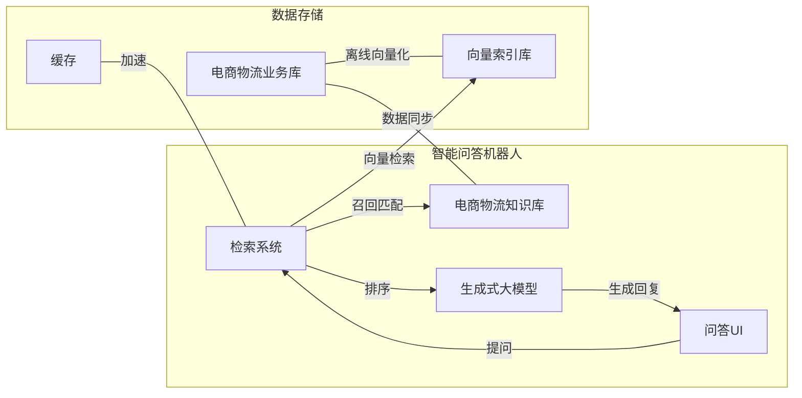
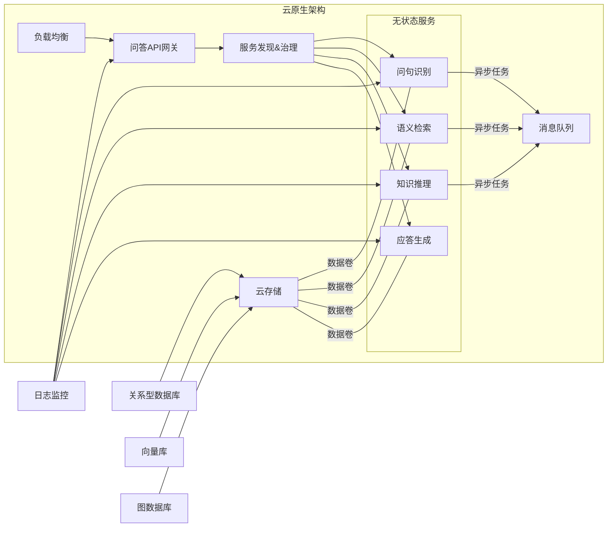
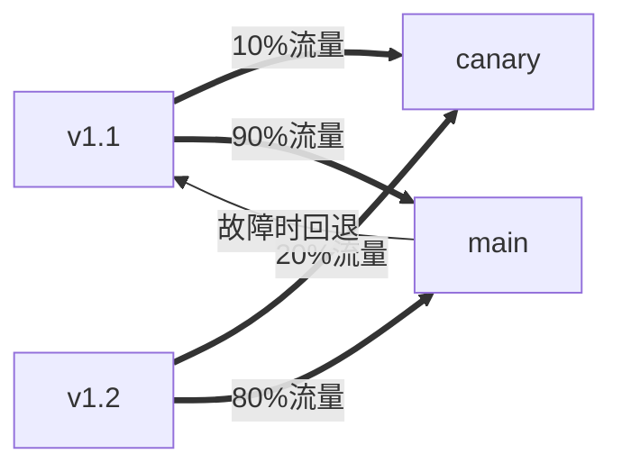
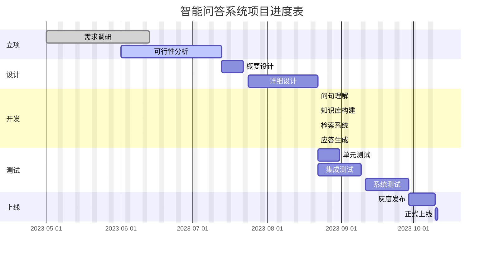
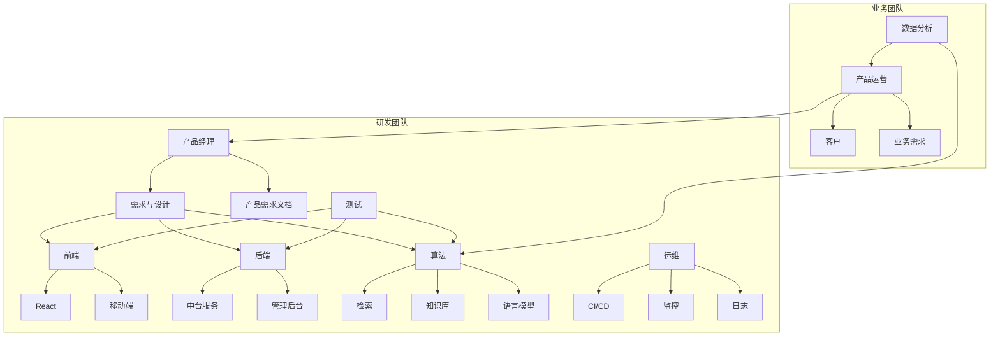

# 电商物流智能问答系统项目文档

## 1. 项目概述

### 1.1 项目背景
电商物流系统是电商平台的重要组成部分,涉及订单管理、仓储配送、异常处理等多个环节。随着业务量的增长,用户对物流体验的要求越来越高。引入智能问答系统,可以大大提升用户咨询的效率和质量,降低人工客服成本。

### 1.2 项目目标
基于现有的电商物流系统数据库,研发一套智能问答机器人,能够针对用户各类物流相关问题给出准确、完整的答复,提升用户体验和运营效率。

### 1.3 项目范围
智能问答系统的服务范围覆盖:
- 订单全流程:发货、配送、签收等各个状态的查询
- 常见场景:如申请退换货、投诉异常件处理进度等
- 业务规则:介绍物流时效、赔付条款等通用和定制化规则
- 新客引导:服务介绍、下单流程指引等

## 2. 系统架构设计

### 2.1 总体架构




### 2.2 检索系统设计

检索系统的目标是从海量电商物流数据中,快速、精准地匹配出与用户问题最相关的知识点,形成feeding进大模型的prompt。其中的关键是实现高效的语义召回。

#### 2.2.1 文档预处理与建库

从电商物流业务数据库中,抽取对问答有价值的表和字段,如订单信息、物流状态、业务规则、FAQ等,转化为结构化的文档。

对原始文档进行预处理:
- 分词:中文采用jieba分词,自定义物流领域词典
- 清洗:去除停用词、标点、特殊字符等
- 规范化:订单号、手机号等字段脱敏
- 字段过滤:去除id、时间戳等价值低的字段

#### 2.2.2 多路召回

实现基于关键词和语义的混合检索:
- 关键词召回:在文档集合上建立倒排索引,使用BM25等算法实现稀疏向量召回
- 语义召回:引入sentence-transformers等预训练模型,将文本编码为语义向量,通过近邻查找实现密集向量召回
- 实体召回:基于物流知识图谱,以关系为边实现实体 + 关系的召回
- 问题召回:对高频问题凭人工配置的FAQ直接召回

将不同路径召回的文档进行归并、去重,作为候选集送入排序模块。

#### 2.2.3 排序优化
使用学习排序(Learning To Rank)中的Pointwise方法对召回的文档进行精排。

排序模型以DNN为主,输入特征包括:
- 原问题与文档的BM25相关性分数
- 问题与文档在多个语义空间的相似度
- 文档字段的权重
- 文档类型、长度等元信息

训练时构造<问题,正例文档,负例文档>三元组,以Pointwise的二分类loss作为目标函数。

在离线评估指标mAP、NDCG达标后,定期利用线上用户反馈数据进行finetune,持续优化排序模型。

### 2.3 大模型生成

#### 2.3.1 模型选型
采用DeepSeeK-R1-32B作为问答生成模型。该模型具有3300亿参数,在通用中文任务上达到业界领先水平,具备强大的知识生成和推理能力。

#### 2.3.2 Prompt构造
将排序出的Top-3文档拼接为Prompt,以问题为Query,通过Few-Shot Prompting引导模型输出。

设计思维链模板,帮助大模型进行逻辑分析、多步推理,提升回答的连贯性。

引入物流知识图谱对大模型输出进行事实校验,提高答案的准确性。

#### 2.3.3 人类反馈学习
收集用户对系统回答的评价反馈,构造正负样本对大模型进行增量学习:
- 肯定反馈作为正例、否定反馈作为负例,引入奖励模型 
- 根据相似问题的反馈相关性,对大模型输出进行 Reweight
- 定期使用新的反馈数据集对模型进行 Finetune

不断纳入人类反馈的闭环学习,持续提升问答效果。

## 3. 功能需求

### 3.1 核心功能
1. 问答对话:用户通过文字或语音提出物流相关问题,系统给出匹配的答复,支持多轮对话
2. 业务办理:提供下单、退换货、投诉等自助办理入口,引导用户通过机器人完成业务
3. 订单查询:用户输入订单号或相关关键词,系统展示订单详情和最新物流状态
4. 业务咨询:回答物流规则、赔付条款等方面的咨询,展示相关的FAQ问答

### 3.2 查询性能
- Peak QPS: 2000/s
- 平均延迟:Query召回500ms以内,整个问答流程3s以内 
- 慢查比例:3s以上查询低于1%

### 3.3 生成质量
- 准确率:业务数据、逻辑推理等方面 准确率>95%
- 连贯性:MultiBLEU>40
- 用户满意度:满意度评分>4.5

## 4. 数据准备

### 4.1 业务数据库解析
解析电商物流数据库表结构,抽取关键表:
- 订单表:订单号、用户、金额、物品等基本信息
- 物流表:配送商、运单号、物流状态等配送信息 
- 地址表:发货地、收货地等配送地址信息
- 商品表:SKU、类目、属性等商品信息
- 规则表:各物流服务的业务约束和规则
- 客服表:用户反馈、工单、FAQ等

### 4.2 文档抽取与Schema映射
根据问答涉及的关键信息,设计文档Schema,通过数据库字段映射生成结构化文档。

订单配送信息文档示例:
```json
{
  "order_id":"80012345",
  "user_name":"张三",
  "product_name":"iPhone 13 Pro",
  "logistics_company":"顺丰速运",
  "tracking_number":"SF8001234",
  "logistics_status":"delivering", 
  "estimated_arrival_date":"2023-05-20",
  "delivery_address":{
    "province":"浙江省",
    "city":"杭州市",
    "detail":"西湖区学院路77号"
  }
}
```

FAQ文档示例:
```json
{
  "question":"申请退货的条件是什么?",
  "answer":"7天无理由退货:自实际收货次日起7天内,商品完好无损,可申请退货。",
  "category":"退换货政策"
}
```

### 4.3 文档预处理
对抽取的原始文档进行清洗、分词、过滤,输出符合检索系统接入标准的文档格式。

引入垂直领域分词工具,提高物流语料的分词质量。构建停用词表过滤低价值词汇。

### 4.4 向量化与索引构建
利用预训练语言模型对文档语料进行向量化编码:
- 英文:使用 all-MiniLM-L12-v2 
- 中文:使用 paraphrase-multilingual-MiniLM-L12-v2

采用Faiss对文档向量进行索引,支持快速的语义检索:
- 文档数<1千万:Flat索引
- 文档数>1千万:HNSW索引

对文档原文在ES中建立倒排索引,支持关键词的模糊、多字段检索。

## 5. 检索优化

### 5.1 查询理解与改写
对用户输入的自然语言查询进行NLU解析,提取查询意图、关键词、约束条件等语义要素。

根据意图将查询分类为订单物流、售后服务、业务咨询等不同类型,进行差异化的查询改写与检索策略路由。

对长尾复杂查询进行简化拆分,先粗排再细筛,减小检索空间。

### 5.2 基于关键词的倒排索引召回
使用ES实现全文检索,针对问题内容进行 Ngram 分词,生成多级召回空间。

在业务字段(如订单号、运单号、收件人等)上建立索引,对结构化数据进行精准匹配。

### 5.3 基于向量的语义召回
利用Faiss计算用户问题和候选文档在公共语义空间的相似度,实现基于向量的快速 Top K 召回。

实现多个粒度的语义向量召回:
- 篇章级:使用文档整体的 embedding 表示
- 段落级:使用滑动窗口对长文档进行切段,在段落粒度进行匹配
- 词级:对关键词使用加权的 word embedding 进行召回

融合多粒度的语义相关度进行召回集合的重排。

### 5.4 融合 ranking
对不同路径检索出的召回集进行归并、去重,使用 ranking model 进行精排,选出最终返回给用户的 Top N 结果。

Ranking model 的特征包括:
- 语义相关性:问题和文档的向量相似度
- 逻辑匹配度:问题中的关键词在文档的出现频率、位置等
- 文档权重:引入业务规则对文档源进行加权
- 用户行为:点击、点赞等交互数据对匹配质量的反馈

具体使用 Pointwise 的二分类模型,离线训练阶段采用 BPR loss, 线上预测阶段使用 Softmax 归一化后的分数作为相关性打分。

## 6. 模型选型

### 6.1 模型选型标准
选择大语言模型作为智能问答的核心,主要考虑:
- 强大语言理解和生成能力
- 支持少样本学习,减少人工标注
- 可解释性好,便于 debug 和持续优化

### 6.2 模型选型结果
选用业界领先的中文通用大模型DeepSeeK-R1-32B:
- 基于海量中文语料预训练,具备强大的中文理解能力
- 3300亿参数,在公开测评中超越 GPT、PaLM、LaMDA 等 
- 在相似问题、摘要生成、对话应答等任务表现出众

针对物流场景下的业务知识,在该基础模型上继续用物流语料 finetune,进一步提升模型的领域适配能力。

## 7. 工程实现

### 7.1 云原生架构


系统采用微服务架构,分层解耦,便于灵活扩容。

对外提供统一的问答 RESTful API。配置Nginx等L7网关,实现负载均衡、流量控制。

内部服务使用 gRPC 通讯。注册到 Consul 或 Nacos 等服务治理平台,实现服务发现、配置管理。

有状态服务(如数据库):
- 业务数据库:MySQL、PostgreSQL 等关系型数据库
- 向量库:Faiss部署于MongoDB等文档数据库之上
- 图谱库:JanusGraph等图数据库

无状态服务:
- 问句识别:意图分类、命名实体识别、依存句法分析等
- 语义检索:Embedding、索引、检索排序等
- 知识推理:基于知识库的逻辑链推理
- 应答生成:Large Language Model生成自然语言应答

云原生DevOps体系:
- CI/CD:代码提交自动触发 Jenkins pipeline进行构建、测试、部署
- 容器化:服务制作成Docker镜像,K8S编排
- 无服务器:弹性、按量计费的 Serverless 服务
- 监控告警:ELK 日志分析、Prometheus 监控、Grafana 可视化

### 7.2 缓存优化
引入分层缓存提升系统性能:
- 本地堆缓存:Guava Cache、Caffeine 等
- 分布式缓存:Redis、Memcached 等

常见的缓存策略:
- 懒加载:首次请求时加载,设置TTL
- 预加载:启动时批量加载热点数据
- 异步刷新:创建定时任务定期刷新
- 写驱动:数据写入时主动更新缓存

缓存的内容主要包括:
- 静态配置:模型参数、系统配置等
- 知识库:索引、向量等
- 检索结果:query召回、排序结果
- 用户信息:用户画像、偏好

使用统一的 KV 来存储,序列化value对象。必要时可对大value进行压缩。

提供redis-py、jedis等多语言SDK,方便各服务集成缓存。

### 7.3 向量数据库优化
海量向量数据的高效存储和计算是检索系统的核心挑战。

Faiss是一个高度优化的相似度搜索库。在本项目中,使用基于 IVF 的 Faiss索引,在召回阶段快速找出TopK近邻。

```python
import faiss 

d = 768                  # 向量维度
nb = 1000000             # 样本总量 
nlist = 4096             # 聚类中心数
m = 8                    # 编码 bits 
k = 10                   # TopK

# 随机生成训练样本向量
xb = np.random.random((nb, d)).astype('float32')
 
# 建立索引
quantizer = faiss.IndexHNSWFlat(d, 32)
index = faiss.IndexIVFPQ(quantizer, d, nlist, m, 8)
index.train(xb)        
index.add(xb)                  

# 存入文件  
faiss.write_index(index, "embeddings.index")

# 查询
xq = query_vector
D, I = index.search(xq, k)     # 距离和ID
```

为进一步优化吞吐和延迟,引入 Milvus 等面向AI应用的向量数据库。

Milvus集成了Faiss等索引库,提供易用的API,支持水平扩展,性能远超Faiss+文件的方案。

部署高可用的Milvus集群:
- 存储:S3对象存储,支持EB级数据 
- 计算:GPU资源池,支持高并发查询
- 分区:按业务属性分区,加速过滤
- 容错:Raft协议保证数据强一致性

### 7.4 测试与部署

制定科学的测试策略,提高测试效率,保障系统质量。

单元测试:
- 测试覆盖率≥80%
- 语句覆盖、分支覆盖、MC/DC覆盖
- 编写足够的正交异常测试用例

接口测试:
- 核心接口测试覆盖率100%
- 采用等价类、边界值、因果图等黑盒测试用例设计方法
- 使用 Postman 等工具完成自动化接口测试

系统测试:
- 从端到端验证系统的功能、性能、兼容性、安全性、可靠性等
- LoadRunner等工具完成性能压测,锁定性能瓶颈 
- Selenium、Appium等工具完成端到端自动化

测试数据:
- 利用爬虫、人工标注等方式获得海量真实测试语料
- 总量不少于1亿条问答对
- 覆盖各类实体、意图、场景

灰度发布:

- 新版本先导入少量真实流量进行灰度测试
- 监控错误率、延迟等关键指标,评估版本质量
- 分批次逐步扩大灰度比例,最终100%上线
- 提供紧急回滚机制,遇故障时秒级恢复

## 8. 项目管理

### 8.1 进度规划


### 8.2 团队组织
项目团队由产品、算法、开发、测试等角色组成,各司其职,密切协作。



### 8.3 风险管理
项目可能面临的风险:
- 技术风险:算法效果不达预期
- 进度风险:研发进度延期
- 需求风险:需求变更频繁
- 质量风险:缺陷引入线上故障

风险应对措施:
- 技术可行性评审,量化指标,充分论证
- 各阶段 checkpoints,及时暴露进度风险
- 版本解耦,引入灵活的配置中心
- 测试驱动开发,单元/接口/系统测试并重
- 故障演练,构建故障自愈容灾体系